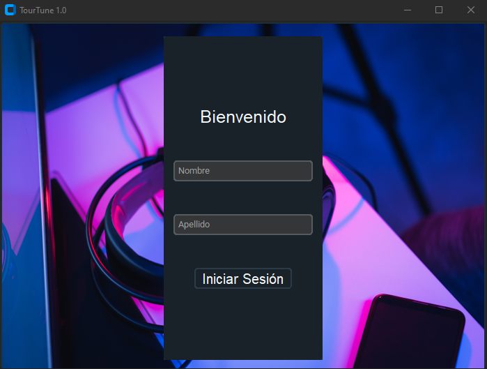
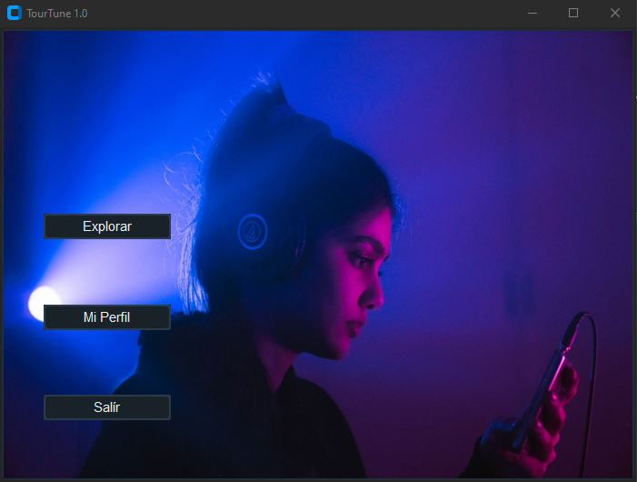
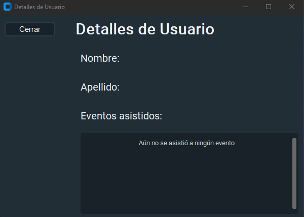
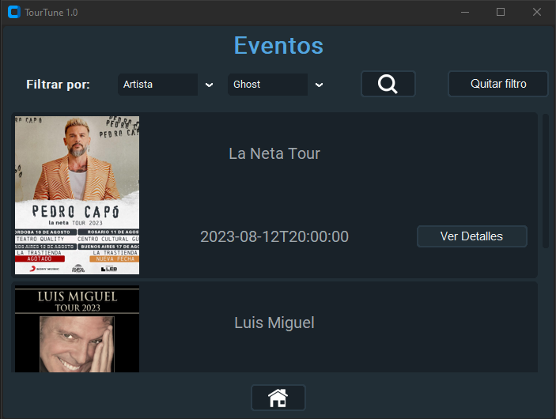
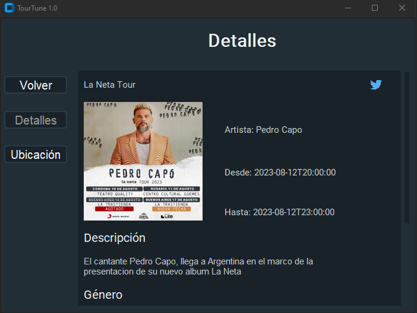
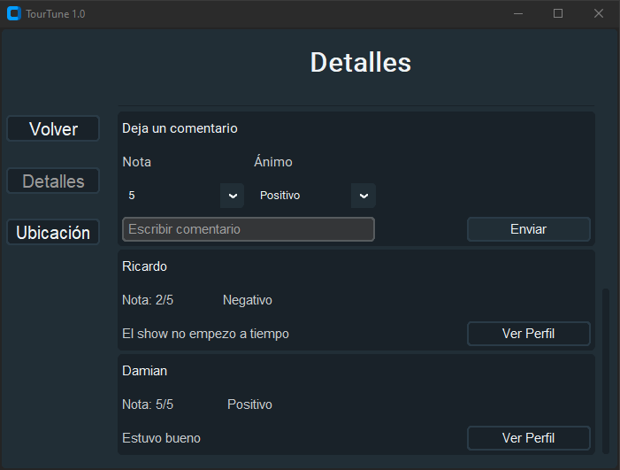
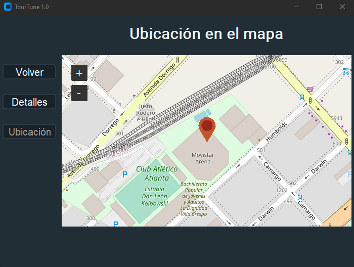

  <h1 align="center">App-Tour-Musical</h1>

App-Tour-Musical es una aplicacion destinada al almacenamiento y distribucion de infomacion de eventos musicales. Informacion tal como ubicacion en un mapa, fecha, hora del evento, etc.
A su mismo tiempo tambien presenta la posibilidad de compartir tu experiencia mediante el uso de comentarios y un sistema de reseña. 

Requiere: `customtkinter` y `PIL`

## Caracteristicas
- Login de Usuario para navegar
- Explorador con busqueda y filtrado para los eventos
- Pantalla detallada sobre informacion de cada evento
- Escritura y visualizacion de reseñas de usuarios
- Habilidad de compartir eventos en redes sociales
- Visualizacion en el mapa de la ubiacion de eventos

## Screenshots

